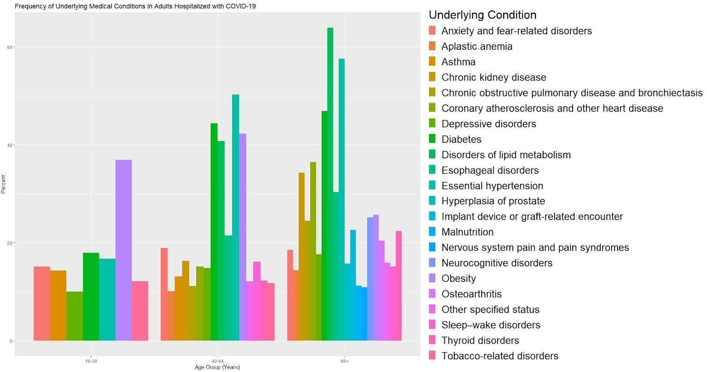
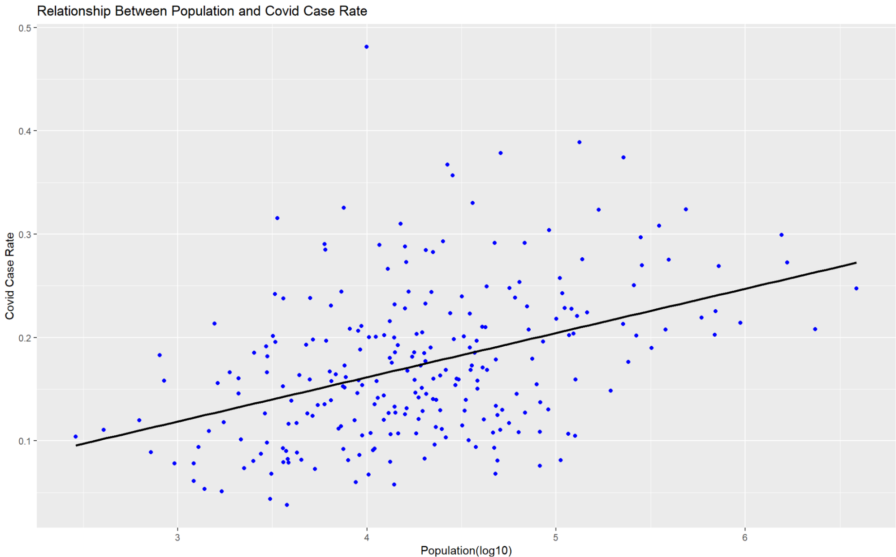
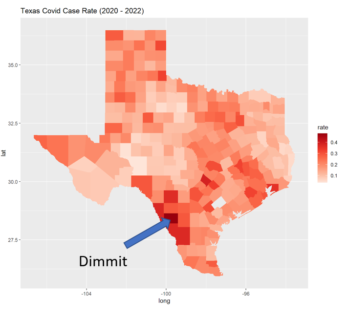
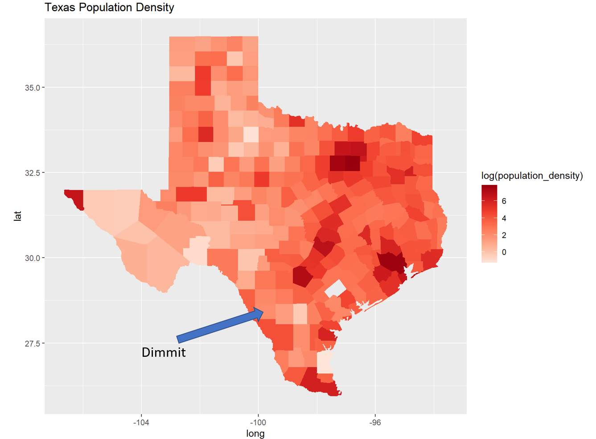
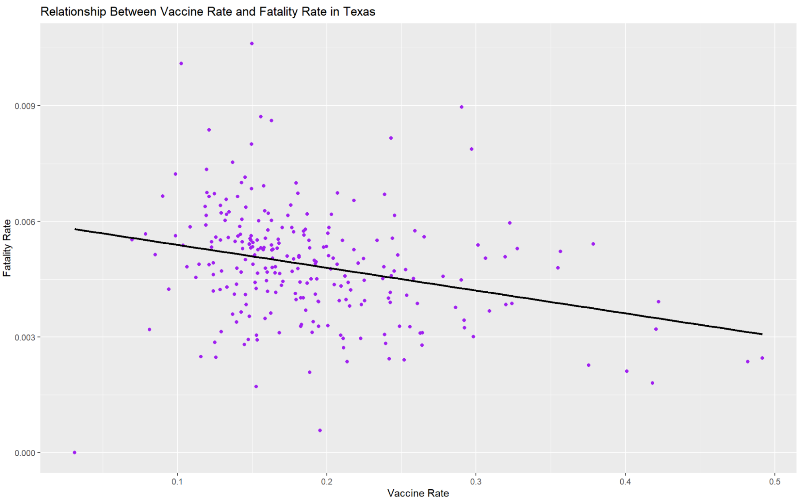
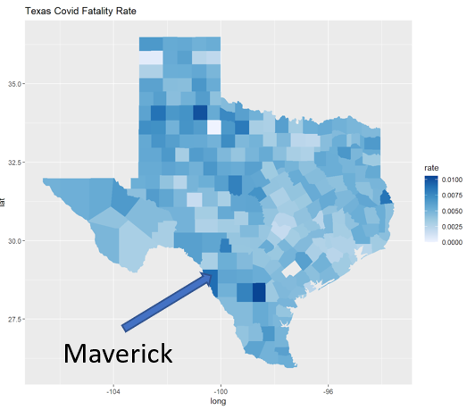
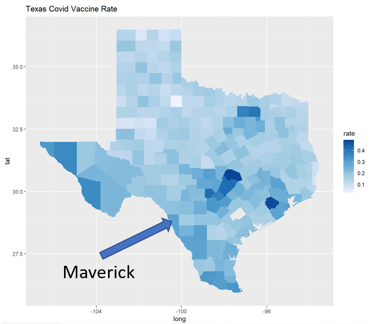
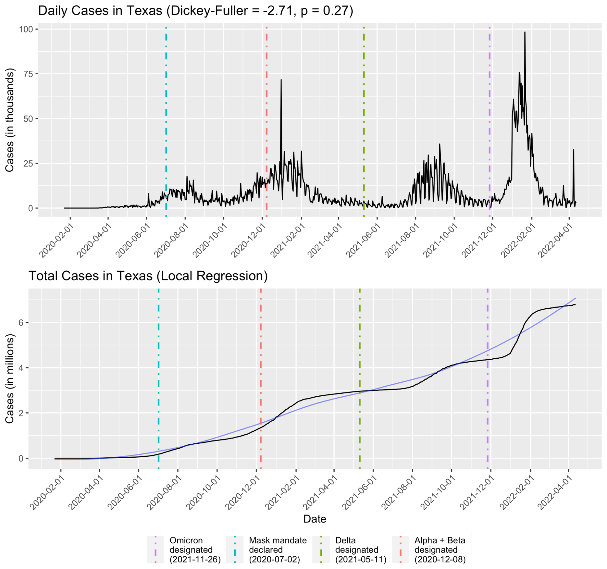
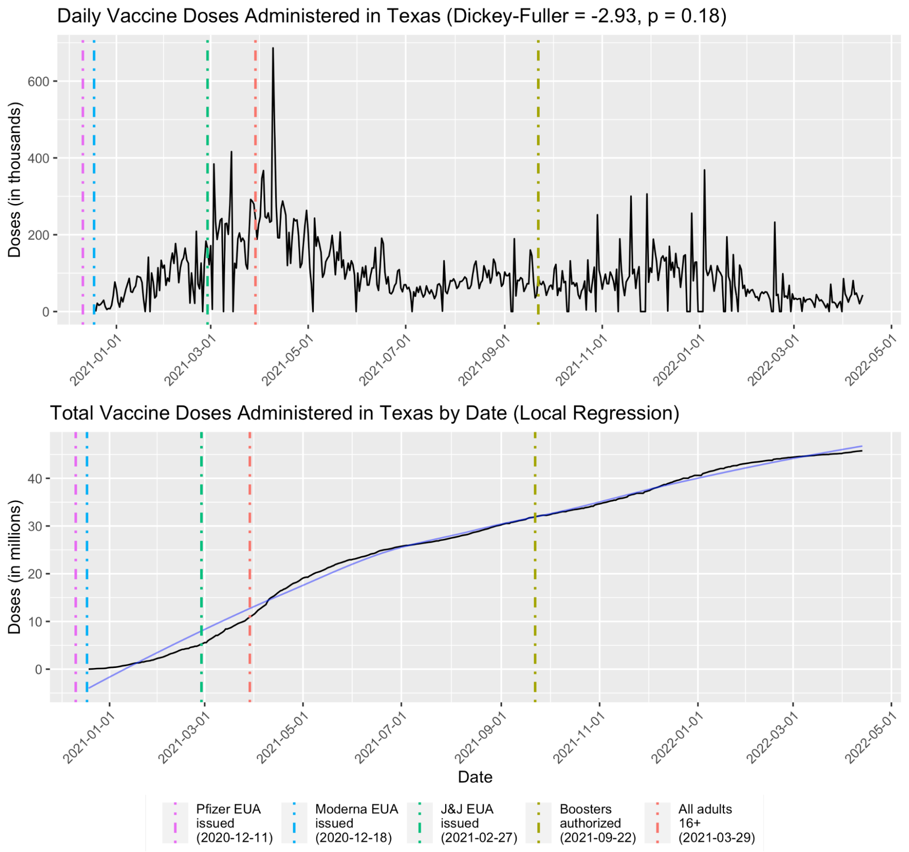

```{r setup, include=FALSE}
knitr::opts_chunk$set(echo = TRUE)
```

# Introduction
With over 400 million cases and six million deaths worldwide, the impact of COVID-19 cannot be understated. Originating in China in December 2019, the COVID-19 pandemic has decimated the global economy and countless people have lost their families to death and disease. Understanding what influences the course of pandemics can help us avert the damage from global crises in the future. For this project, we wanted to see the impact of COVID in our home state of Texas; however, not all counties experienced the pandemic in the same way. Our goal was to understand the factors that influence COVID cases and deaths, with a focus on the different Texas counties. We also attempted to forecast COVID cases and vaccine administrations in Texas. By increasing our understanding of pandemic trends, we can be more prepared for future health crises. 

Our questions relate to the behavior of COVID. For instance, in our first question we examined which health conditions increase the probability of getting hospitalized with the virus. With this information, we can determine which groups of people are most at risk based on their underlying conditions. Next, we analyzed whether the geographic distribution and population in Texas were correlated with COVID cases. After that, we attempted to determine whether there was a correlation between the fatality rate and vaccination rate in Texas. For our last question, we attempted to forecast COVID cases and vaccine uptake because it would be a useful indicator of potential surges in cases.

We employed five different datasets. The first and primary dataset was the COVID-19 Repository managed by the Johns Hopkins University Center for Systems Science and Engineering: specifically, the data within that pertained to Texas, which contained important variables such as county, confirmed cases, active cases, and deaths. We also used four secondary datasets. The second dataset, from the Coronavirus Resource Center at the Johns Hopkins Centers for Civic Impact, contains vaccine data, with variables such as state, date, vaccine type, number of vaccinations, number of cases, number of doses administered. We used this information to determine vaccine counts for each county and vaccine doses over time. The third dataset, from the Texas Department of State Health Services, contains monthly cases in Texas from March 2020 to March 2022 stratified by age group. Variables include the month and year (Month Year), age groups (<1, 1-9, 10-19, 20-29, 30-39, 40-49, 50-59, 60-69, 70-79, 80+), and total (Total). Using this information, we created graphs that demonstrate the distribution of ages for people affected by COVID-19. The fourth dataset, from a study conducted by CDC, contains the number and percent of adults hospitalized with COVID-19 with different underlying conditions as variables stratified across three different age groups. This dataset is composed from 540,667 adults hospitalized from March 2020 to March 2021. Information from this dataset was used to determine which underlying conditions increase an adult’s probability of being hospitalized by COVID-19. Finally, the fifth dataset was the Land Area from The County Information Program of Texas Association of Counties, containing the counties in Texas and their respective areas. We used this information to determine population density of Texas counties. 


# Data Cleaning
## Underlying conditions
We began by reading the table from the CDC dataset into R. First, we removed any blank rows and columns from the data frame. Next, we separated the data frame into three different ones for the three age groups. Then, we used a for loop for each data frame to extract only the percent of each underlying condition, which was necessary because the relevant indices contained both the number of cases and the percent in parentheses. Then, we created a new data frame by adding a column that displayed the age group for each underlying condition. This was done by using the mutate function. Finally, we took these data frames and used the rbind function to combine them into one. 

## Geography, population, and COVID figures
We imported the COVID case data and extracted the accumulative COVID case data from the Texas COVID case dataset. We only selected rows one and seventy-six from the dataset. Then, we joined the COVID case dataset with the Texas map dataset by using their county names. After mulitple initial failures, we finally managed to join the two datasets by lowering the county name and deleting the comma in the COVID case column. After joining the datasets, we needed to change the structure from character to numerical. In order to plot the correlation between population density and COVID case rate, we first found the COVID case rate by divided COVID cases by population in each county. We also found the population density by dividing the population in each county by county area. We used ggplot2 to plot the correlation graph, and we chose continuous because our COVID case rates are continuous data. Finally, we applied a linear model to test whether we should accept or reject the null hypothesis in this scenario. 

## COVID fatalities and vaccines
We imported the COVID vaccine data and extracted the data from the COVID vaccine dataset by choosing the people who took booster shots. We assumed that people who finished three shots were fully vaccinated. We selected the data from the first and seventh columns and renamed them to make sure we could join them with the Texas dataset. After joining the two datasets together, we deleted the duplicate row. We used ggplot to plot the correlation graphs depicting Texas COVID fatality rate, and Texas COVID vaccine rate. With the correlation graph, we used the Spearman correlation coefficient, because it gave us a higher correlation. We applied a linear model to test whether we should accept or reject the null hypothesis at the end, then observed the p-value and decided that we have strong evidence to conclude that COVID vaccine rate and fatality rate are correlated. 	

## Predicting COVID caseloads and vaccine doses
For the case time series, we began with the spreadsheet for cases through 04/13/2022 from the JHU CSSE dataset for confirmed COVID-19 cases in the US. After loading the spreadsheet into R, we extracted the rows pertaining to Texas counties and stored them in a new dataframe using dplyr. Then, since the cases by county were stored in columns, we transposed the dataframe so that the cases by county were now stored in rows. From there we created new variables to sum total cases in every county, took the differential of each day to get the daily cases in the whole of Texas, removed all days with negative reported cases, and then divided daily cases by thousands and total cases by millions for easier viewing once plotted. Then, we created a new date variable by extracting row names, and used lubridate to convert the dates from character to a special Date format, which would be recognized by ggplot when plotting a time series. 

The vaccine time series followed a similar process. We began with the spreadsheet for vaccine data through 04/13/2022 from the JHU CCI dataset. After loading the spreadsheet into R, we extracted the rows pertaining to Texas counties and included all vaccine types, as we were not interested in distinguishing between different vaccine manufacturers. Then, we extracted the columns containing the date and cumulative number of doses administered for each day. We took the differential of each day to get the daily vaccine administrations in Texas, and for easier viewing once plotted we divided this number by thousands, and total vaccine administrations by millions. As a final step, we removed all rows containing “NA” and negative values for vaccine administrations.


# Questions and Findings
## Do other health conditions increase the probability of getting hospitalized for COVID-19? If so, which ones?
This graph contains information about the frequencies of underlying conditions across three different age groups. First, we took data from the CDC for different age groups. Each age group was an individual graph at one point. We put them side by side to make one graph and made one y-axis apply to all graphs. The graph shows the top three underlying conditions for adults hospitalized with COVID-19. They are obesity, diabetes, and essential hypertension. The most frequent condition in the sixty-five and older age group is disorders of lipid metabolism. Interestingly, some conditions in this category can lead to heart disease which is part of the essential hypertension category. For instance, dyslipidemia, which is the presence of high levels of lipids in the bloodstream, can raise blood pressure and lead to heart disease.

\newline


## Are the geographical distribution and population figures in Texas correlated with COVID-19 cases?

\newline

We were curious as to whether population density and COVID case rate are correlated. Our analysid found that the correlation between the two is 0.4029131, which satisfies our intuitive assumption that counties with larger areas will have more infections. It is reasonable that the more populous counties have higher population density, where people are more likely to gather and become infected. We also performed the significance test, which returned a p-value of 0.00057. In this scenario, the null hypothesis is that population density and COVID case rate are not correlated. The alternative hypothesis is that population density and COVID case rate are correlated. Since we obtained a very small p-value, we reject the null hypothesis. Therefore, we had strong evidence to draw the conclusion that population density and COVID case rates are correlated to each other, albeit not very strongly. However, there are many outliers on the graph; therefore, our next goal was to find the causes of the outliers.


\newline

\newline

To compare each county's COVID case rate and population density, we plotted the above two maps. In order to obtain the COVID case rate, we divided cumulative COVID cases in Texas by the total number of people in each county. To obtain population density, we divided the population by the area of different counties. For instance, Harris County has a very high population density and a relatively high COVID case rate, which reflects the positive correlation between these two factors. However, since the correlation is about 0.402913, it is not very strong. We wanted to identify the factors that caused the outliers in this graph. We first considered politics as be one of the factors, assuming that Republicans are less likely to take the vaccine and that Democrats are more likely to take the vaccine. After collecting the data and comparing them with different counties, we did not find enough evidence to conclude that politics is a factor in the outliers in Texas. 

One outlier, Dimmit County, is far away from the others. We were not able to identify any factors that directly caused this outlier; therefore, we considered the possibility of a sampling error. A sampling error arises from errors made when the data is collected. This could be one reason that Dimmit County had abnormal data in this dataset. In addition, local gatherings may be one of the reasons behind the outliers. Some counties may perform customs such as festivals, and many people gathering together could cause mass infection. Other possibilities for the distribution not fitting our data include random errors or fitting errors.


## Is the COVID-19 fatality rate correlated with the vaccination rate in Texas?
\newline

We were also curious whether vaccine rate and fatalities rate are correlated. Our analysis found that the correlation between the vaccine and fatalities rates is -0.3265792, satisfying our intuitive assumption that more vaccinated people leads to fewer people dying. We performed a significance test, which returned a p-value of 5.59e-06. In this scenario, our null hypothesis is that vaccine rates and fatalities are not correlated, with the alternative hypothesis being that they are. Our very small p-value led us to reject the null hypothesis; therefore, we had strong evidence to draw the conclusion that vaccine rates and fatality rates are negatively correlated. However, there are many outliers on this graph; our next goal was to identify the causes of the outliers. 


\newline

\newline

The two maps above helped us easily compare each county in Texas. First, we plotted the Texas COVID fatality rate by county. Dividing the number of COVID deaths by the total county population gave us the fatality rate. The second map is the Texas COVID vaccine rate by county. As our definition of fully vaccinated included booster shots, dividing the number of booster administrations by the total county population gave us the vaccine rate. We then attempted to find the factors behind the outliers. Firstly, we examined age: we compared the median age in different counties and found that the outlier counties do not have a very high median age. Then, we analyzed whether people above 65 years old could be classified as outliers; when a county has more senior people, it is more likely to have a higher fatality rate. However, almost all the counties analyzed only have a 65 and older population of approximately 10%. 

Secondly, we considered whether education could have caused the outliers. We collected data for different counties in Texas; however, we cannot find enough evidence to prove that education level and fatality rate or vaccine rate are correlated. 

Thirdly, we considered whether socioeconomic status could be a factor. We found that outlier counties have a relatively higher unemployment rate. For example, Maverick County's unemployment rate was 15.0% in 2020, which is considered very high. We observe that Maverick has a relatively high vaccine rate, but its fatality rate is also very high. Intuitively, we reasoned that destitute individuals and families are more likely to die when they get COVID even when vaccinated because they cannot pay for treatment; therefore, the fatalities among such a population would be higher than in other counties. Additional factors behind the outliers could include population density.


## Is it possible to predict the future course of COVID-19 cases and vaccine administrations in Texas?

To approach this question, we began by visualizing cases and vaccines over time to attempt to identify any trends. Our first step was to construct two time series of daily and total caseloads in Texas from 01/22/2020 through 04/13/2022, as seen below. On the top is a plot of daily cases over time, and on the bottom is a plot of total cases over time fitted by a LOESS trendline. 

\newline

From this plot, we see that there do not appear to be any identifiable trends, but we can identify spikes in cases; however, these spikes appear to be random and to vary over time. This behavior is mirrored in the plot of total cases, with random changes in slope. This suggests non-stationary behavior. To forecast any time series, we require the series to be stationary, because any models fit or forecasts made on non-stationary series may not be accurate. Non-stationary behaviors include trends, cycles, random walks, or combinations of the three.

To verify non-stationarity of cases, we performed a statistical test, the augmented Dickey-Füller test, which determines whether to reject the null hypothesis that cases are stationary. Limitations of the augmented Dickey-Füller test primarily concern its high type I error rate; that is, its occasional failure to detect stationarity, but we determined that the test is more than sufficient for our purposes. For cases over time, the test returned a value of -2.71. A more negative Dickey-Füller value is interpreted as a greater likelihood that the time series is stationary; however, the associated p-value is 0.27. Therefore, we fail to reject the null hypothesis and conclude that the progression of cases is non-stationary. 

To attempt to explain spikes in cases and try to discern a pattern, we mapped certain significant real-world events to the time axis. These events were selected based on perceived relevance to increases or decreases in cases. Each event slightly precedes each spike in cases. The first event, labeled in blue, is Governor Greg Abbott’s mask mandate issued on 07-02-2020. It corresponds with the relatively small spike around July 2020. This is around the time when coronavirus cases were beginning to skyrocket in the US, and by extension, Texas. The second event, labeled in red, is the World Health Organization’s Variant of Concern designation of the more contagious Alpha and Beta variants of the coronavirus on 12-08-2020. It corresponds with the much larger spike around January 2021. Additional factors could involve an unusually cold winter, which likely caused more people to gather indoors, facilitating the further spread of the virus. The third event, labeled in green, is the WHO’s Variant of Concern designation of the even more contagious and much deadlier Delta variant on 05-11-2021. It corresponds with a spike similar in size to the second one throughout the summer of 2021, with a lack of further growth possibly attributable to increased lethality. The fourth and most recent event we mapped, labeled in purple, is the WHO’s Variant of Concern designation of the most contagious Omicron variant on 11-26-2021. It corresponds with the largest spike yet in February 2022. Finally, we can see that cases were rising again at the end of our dataset, which is possibly attributable to the BA.2 subvariant of Omicron. From this analysis, we conclude that spikes do not follow a recognizable pattern.

Since the progression of cases is non-stationary and does not appear to follow a recognizable pattern, we cannot predict with reasonable accuracy whether cases will go up or down. Though there exist methods to transform non-stationary time series into stationary time series, we will not explore them in this report as they are beyond the scope of this class. At best, our attempt to model total cases over time with a LOESS trendline suggests that cases will continue to rise, but at a steady rate rather than increasing over time. 

Next, we constructed a time series of daily and total vaccine administrations in Texas from 12/19/2020 through 04/13/2022. On the top is a plot of daily vaccine doses over time, and on the bottom is a plot of total vaccine doses over time fitted by a LOESS trendline. 

\newline

As with cases, we fail to observe any identifiable trends from this plot. We can identify spikes in cases, but only two random spikes with one much more defined than the other. This behavior is mirrored in the plot of total vaccine doses. This again suggests non-stationary behavior of vaccine doses. 

To verify non-stationarity of vaccines, we performed the augmented Dickey-Füller test once again. For doses over time, the test returned a value of -2.93 with an associated p-value of 0.18. Therefore, we again fail to reject the null hypothesis and conclude that the progression of vaccine doses is non-stationary. 

To attempt to explain spikes in vaccines and try to discern a pattern, we mapped events based on perceived relevance to vaccine distribution to the time axis. Each event slightly precedes each spike in vaccine doses. The first three events, labeled in purple, blue, and green respectively, are the FDA emergency use authorizations for the Pfizer-BioNTech, Moderna, and Johnson & Johnson vaccines issued on 12-11-2020, 12-18-2020, and 02-27-2021 respectively. Being the first two vaccines authorized in the United States, the authorizations of the Pfizer-BioNTech and Moderna vaccines represent the beginning of vaccine administrations in Texas. However, at this point the vaccines were not eligible to those not employed at high risk workplaces or with high risk conditions. This changed with the fourth event, labeled in red, the expansion of eligibility to all adults 16 and older for the Pfizer-BioNTech vaccine and all adults 18 and older for Moderna and Johnson & Johnson. This event directly precedes the largest spike in vaccine administrations around April 2021. This is followed by a long period of stagnation in doses, for which possible explanations include the fact that vaccines are administered only a set number of times to each person, a high rate of vaccine hesitancy, and the possibility that those who wish to get vaccinated have already been vaccinated. This drought lasts until the last event we identified, the FDA authorization of booster doses, labeled in olive on 09-22-2021. This event corresponds with the most recent spike in doses from fall to winter 2021. This spike is much less defined and more of a hump. Possible explanations for this behavior involve the fact that only a fraction of those who received their initial dose sequence elected to receive boosters, and the fact that everyone’s dose schedule was different, which complicated the CDC suggestion that people should wait 6 months after their Pfizer-BioNTech or Moderna second dose, and 4 months after their Johnson & Johnson dose. From this analysis, we conclude that spikes do not follow a recognizable pattern. This unpredictable behavior can be attributed to factors such as differing dose schedules between different vaccines, differing schedules between different populations, and vaccine hesitancy.

Since the progression of vaccine doses is non-stationary and does not appear to follow a recognizable pattern, we cannot predict with reasonable accuracy whether doses will go up or down. Our attempt to model total doses over time with a LOESS trendline suggests that doses have leveled off and will not continue to rise in the future.


# Conclusions
## Obesity, diabetes, and essential hypertension increase the risk of hospitalization for COVID-19
Obesity, diabetes, and essential hypertension form the most implicated factors responsible for hospitalizing patients infected with COVID-19; notably, the most frequent conditions in the sixty-five and older age group are disorders of lipid metabolism. Interestingly, some conditions in this category can lead to heart disease which falls under the umbrella of essential hypertension. For instance, dyslipidemia, which is the presence of high levels of lipids in the bloodstream, can raise blood pressure and lead to heart disease. Often, more than one condition is present in an individual. This suggests that there may exist certain relationships between these conditions that increase an individual’s risk level. Considering that different regions of Texas have differing prevalence of different diseases, geographical factors such as population density becomes relevant when studying the risk factors of COVID-19.

## Population density and COVID-19 cases are positively correlated in Texas
Our analysis found that higher population density is correlated with a higher incidence of COVID-19 in Texas. This has implications for public health policy when considering pandemic response; for instance, it may be preferable to adopt different pandemic responses for a major urban location compared to a rural region. Social distancing may be more stringent in a large city, while it is less rigidly enforced in the countryside. However, our group believes that vaccine policy should always be uniformly strict, because of our next findings below.

## COVID-19 fatality rate and COVID-19 vaccination rate are negatively correlated in Texas
There is a clear negative correlation between COVID-19 vaccinations and fatalities in Texas, making it more important than ever to get vaccinated and boosted. Though outliers exist, our group believes that vaccination is the overwhelmingly better choice for the vast majority of people to avoid dying from COVID-19 infection. With these conclusions in consideration, it becomes necessary to look to the future to attempt to predict the behavior of the pndemic, so that we may be prepared.


## Forecasting of COVID-19 cases and vaccine administrations in Texas is not recommended due to unpredictable behavior
Unfortunately, with our current techniques, we were unable to perform sufficiently accurate or trustworthy forecasting of COVID-19 cases and vaccine administrations in Texas, in large part due to the unpredictability of either metric and the lack of discernable patterns. However, we were able to map certain significant events to spikes in cases and vaccine administrations, suggesting that spikes can be “predicted” in a certain sense with very short notice. For instance, when the public becomes aware of a new variant, that may suggest that cases are about to spike soon, and the authorities should adopt the appropriate measures to try and dampen the blow of incoming cases to reduce stress on the healthcare system and the economy.


# Future Directions
In the interest of time and the limits of our knowledge, we constrained our project to a certain scope. In future research, we would like to explore more specific problems related to demographics. For example, we would like to study the age, race, and socioeconomic status of people who are more or less likely to get COVID-19, more or less likely to get vaccinated, more or less likely to wear masks, and so on. Such insights could inform other parts of our analyses, such as forecasting. With further training, we would also like to apply more complex methods to attempt to predict daily cases and vaccine doses while accounting for the aforementioned factors such as local demographics and existing health conditions. These methods include transforming time series to achieve stationarity, and techniques for fitting and forecasting time series, which include the simple moving average, weighted moving average, exponential moving average, autoregressive integrated moving average, Bayesian models, and so on. 

# Appendix: Code
Our project code is [publicly available on GitHub](https://github.com/kevinwjin/covid-19-associations/). It is also included below divided into sections by main topic, for the convenience of the reader.

## Underlying conditions
```{r eval = FALSE}
# Library
library(UsingR)
library(tidyverse)
library(dplyr)
library(plyr)
library(readxl)
library(ggplot2)
library(gridExtra)
library(cowplot)
library(grid)
library(gapminder)

#---------------------------------------------------------------------------------------

# Data from https://dshs.texas.gov/coronavirus/additionaldata/  
# Case and Fatality Demographics Data -> 
# Case and Fatality Demographics Data - Counts

# Create New Data Frame and replace the file location with your own
Coviddemo <- read_excel("COVIDdemo.xlsx")


#Data Cleaning
colnames(Coviddemo) <- c("Month Year", "<1", "1-9", "10-19", "20-29", 
                         "30-39", "40-49", "50-59", "60-69", "70-79", "80+", 
                         "Total")
Coviddemo <- Coviddemo[-c(1, 2, 3, 15, 29, 32, 34, 35, 36, 37),]
Coviddemo <- Coviddemo[-c(11,24,26),]
Coviddemo <- Coviddemo[-24,]
Coviddemo <- Coviddemo[-12]
Demorownames <- Coviddemo$`Month Year`
Coviddemo <- Coviddemo[-1]
rownames(Coviddemo) <- Demorownames
Coviddemo <- t(Coviddemo)
lablist <- colnames(Coviddemo)

# Graph
barplot(as.matrix(Coviddemo),
        cex.names = 0.65,
        las = 2,
        legend = TRUE,
        ylim = c(0, 10000)
        )

#-------------------------------------------------------------------------------

# Data from https://www.cdc.gov/pcd/issues/2021/21_0123.htm#tables
# Table 1

# Create New Data Frame and replace the file location with your own
CovidCDC <- read_excel("CDCcovid.xlsx")

# Data Cleaning
Preexisting <- data.frame(CovidCDC[4:11,])
Preexisting <- Preexisting[-c(1, 2, 3),]
rownames(Preexisting) <- Preexisting$Column1
Preexisting <- Preexisting[-c(1, 2)]
colnames(Preexisting) <- c("Full Sample", "ICU", "IMV", "Died")


#Convert to percentage

Preexisting$`Full Sample` <- c(5.1, 7.4, 39.3, 31.0, 17.3)
Preexisting$`ICU` <- c(2.9, 5.7, 37.8, 34.0, 19.6)
Preexisting$`IMV` <- c(1.5, 3.6, 35.7, 37.5, 21.6)
Preexisting$Died <- c(0.9,2.6, 32.3, 39.1, 25.1)

# Graph of Percent of Covid Patients with Underlying Health Conditions
barplot(as.matrix(Preexisting), cex.names = 0.8,
        xlab = "Hospitilized Adult Patients with COVID-19 March 2020\\
        - March 2021",
        ylab = "Percent",
        legend = TRUE,
        xlim = c(0, 7),
        args.legend = list(title = "No. of Conditions"),
        main = "Percent of COVID Patients with Underlying Health Conditions",
        cex.main = 1,
        )


#-------------------------------------------------------------------------------

# Data from https://www.cdc.gov/pcd/issues/2021/21_0123.htm#tables
# Table 1

# Alternate Graph of Percent of Covid Patients with Underlying Health Conditions

# Data Cleaning
Preexisting1 <- data.frame(CovidCDC[4:11,])
Preexisting1 <- Preexisting1[-c(1, 2),]
Preexisting1 <- Preexisting1[-c(3:6),]
rownames(Preexisting1) <- Preexisting1$Column1
greaterthan1 <- substring(rownames(Preexisting1)[1],1,2)
Preexisting1 <- Preexisting1[-c(1, 2)]
rownames(Preexisting1) <- c(greaterthan1, "0")
colnames(Preexisting1) <- c("Full Sample", "ICU", "IMV", "Died")


# Convert to percentage
Preexisting1$`Full Sample` <- c(94.9, 5.1)
Preexisting1$`ICU` <- c(97.1, 2.9)
Preexisting1$`IMV` <- c(98.5, 1.5)
Preexisting1$Died <- c(99.1, 0.9)

# Graph
barplot(as.matrix(Preexisting1), cex.names = 0.8,
        xlab = "Hospitilized Adult Patients with COVID-19 March 2020 - \\
        March 2021",
        ylab = "Percent",
        legend = TRUE,
        xlim = c(0, 7),
        args.legend = list(title = "No. of Conditions"),
        main = "Percent of COVID Patients with Underlying Health Conditions",
        cex.main = 1,)

#-------------------------------------------------------------------------------

# Data from https://www.cdc.gov/pcd/issues/2021/21_0123.htm#tables
# Table 3

# Side by Side bar graph of frequency of underlying medical conditions of adults
# hospitalized with COVID


# Create New Data Frame and replace the file location with your own
Underlying <- read_excel("CDCunderlying.xlsx")


# Data cleaning
Underlying <- Underlying[-c(3, 4, 5)]
Underlying <- Underlying[-c(1, 2, 3, 4, 8, 9, 18, 19, 58, 59),]

AgeGroup18 <- Underlying[c(2:8),]
names(AgeGroup18) <- c("Underlying Condition", "Percent")
 
AgeGroup40 <- Underlying[c(10:25),]
names(AgeGroup40) <- c("Underlying Condition", "Percent")

AgeGroup65 <- Underlying[c(47:66),]
names(AgeGroup65) <- c("Underlying Condition", "Percent")

for(x in 1:nrow(AgeGroup18)){
  AgeGroup18$Percent[x] <- substr(AgeGroup18$Percent[x], 
                                              nchar(AgeGroup18$Percent[x]) - 4, 
                                                     nchar(AgeGroup18$Percent[x]) - 1)
}

for(x in 1:nrow(AgeGroup40)){
  AgeGroup40$Percent[x] <- substr(AgeGroup40$Percent[x], 
                                  nchar(AgeGroup40$Percent[x]) - 4, 
                                  nchar(AgeGroup40$Percent[x]) - 1)
}
  
for(x in 1:nrow(AgeGroup65)){
  AgeGroup65$Percent[x] <- substr(AgeGroup65$Percent[x], 
                                  nchar(AgeGroup65$Percent[x]) - 4, 
                                  nchar(AgeGroup65$Percent[x]) - 1)
}

# Create new data frames with a category column

G18 <- mutate(AgeGroup18, Group = rep("18-39", 7))
G40 <- mutate(AgeGroup40, Group = rep("40-64", 16))
G65 <- mutate(AgeGroup65, Group = rep("65+", 20))

# Combine into one data frame
combined <- rbind(G18,G40, G65)

# Graph (Use Zoom for True Graph)
ggplot(data = combined, mapping = aes(x = Group, y = as.numeric(Percent), 
                                      fill = `Underlying Condition`)) +
  geom_bar(stat = "identity", position = "dodge") + 
  theme(legend.key.size = unit(0.5, "cm"), legend.position = "right", 
        legend.text = element_text(size=20), 
        legend.title = element_text(size = 24)) +
  guides(fill = guide_legend(nrow = 22, byrow = TRUE)) + 
  ggtitle("Frequency of Underlying Medical Conditions in\\ 
          Adults Hospitalized with COVID-19") + 
  ylab("Percent") +
  xlab("Age Group (Years)")

```

## Geography, population, and COVID figures
```{r eval = FALSE}
# Relationship Between Population and Covid Case Rate
library(dplyr)
library(ggplot2)

# Read Texas dataset 
tx <- read.csv("map_texas.csv", stringsAsFactors = FALSE)


# Read covid case data and clean the data 
Texas <- read.csv("Texas.csv")
Texas <- select(Texas, 1, 76)
names(Texas) <- c("county", "summary")
Texas$county <- tolower(Texas$county)
Texas <- Texas[c(3: 256), ]
texas_new <- left_join(tx, Texas, by = "county")
texas_new$summary <- as.numeric(texas_new$summary)
range(texas_new$summary, na.rm = TRUE)

# Caculate the covid case rate
texas_new$rate <- texas_new$summary / texas_new$pop

# Delete the duplicate rows
texas_new_data <- texas_new[!duplicated(texas_new$county), ]

# Plot the map of the covid case rate
ggplot(data = texas_new_data) +
  geom_point(mapping = aes(x = log10(pop), y = rate), color = "blue")+
  geom_smooth(mapping = aes(x = log10(pop), y = rate), color = "black", 
              method = "lm", se = FALSE)+
  labs(title = "Relationship Between Population and Covid Case Rate", 
       x = "Population(log10)", y = "Covid Case Rate" )


# Find the correlation of the texas 
cor(texas_new_data$pop, texas_new_data$rate, use = "complete.obs", 
    method = "spearman")

# Applied Linear Model
model_1 <- lm(texas_new_data$rate ~ texas_new_data$pop)


# Texas Covid Case Rate Map
library(dplyr)
library(ggplot2)

# Read Texas dataset 
tx <- read.csv("map_texas.csv", stringsAsFactors = FALSE)


# Read covid case data and clean the data 
Texas <- read.csv("Texas.csv")
Texas <- select(Texas, 1, 76)
names(Texas) <- c("county", "summary")
Texas$county <- tolower(Texas$county)
Texas <- Texas[c(3: 256), ]
texas_new <- left_join(tx, Texas, by = "county")
texas_new$summary <- as.numeric(texas_new$summary)
range(texas_new$summary, na.rm = TRUE)

# Caculate the covid case rate
texas_new$rate <- texas_new$summary / texas_new$pop

# Plot the Texas covid case rate Map
ggplot(subset(texas_new, !is.na(rate))) +
  geom_polygon(mapping = aes(x = long, y = lat, group = group,
                             fill = rate))+
  coord_quickmap()+
  scale_fill_distiller(palette = "Reds", direction = 1) +
  labs(title = "Texas Covid Case Rate(2020 - 2022)")

# Texas Population Density Map
library(dplyr)
library(ggplot2)

# Read Texas dataset 
tx <- read.csv("map_texas.csv", stringsAsFactors = FALSE)

# Read Texas area dataset and clean the data 
texas_area <- read.csv("Area.csv", stringsAsFactors = FALSE)
texas_area$X <- gsub(",", "",texas_area$X)
names(texas_area) <- c("county", "area")
texas_area$county <- tolower(texas_area$county)
texas_area$area <- as.numeric(texas_area$area)
tx <- left_join(tx, texas_area, by = "county")
tx$population_density <- tx$pop / tx$area

# Plot Texas Population Density
ggplot(subset(tx, !is.na(log(population_density)))) +
  geom_polygon(mapping = aes(x = long, y = lat, group = group,
                             fill = log(population_density)))+
  coord_quickmap()+
  scale_fill_distiller(palette = "Reds", direction = 1)+
  labs(title = "Texas Population Density")

```

## COVID fatalities and vaccines
```{r eval = FALSE}
# Relationship Between Vaccine Rate and Fatality Rate in Texas
library(dplyr)
library(ggplot2)

# Read Texas dataset
tx <- read.csv("map_texas.csv", stringsAsFactors = FALSE)

# Read Texas covid vaccine rate dataset and clean the data
covid_vaccine <- read.csv("Vaccine.csv")
covid_vaccine <- select(covid_vaccine, 1, 7)
names(covid_vaccine) <- c("county", "vaccine")
covid_vaccine$county <- tolower(covid_vaccine$county)
covid_vaccine <- covid_vaccine[c(4: 257), ]
texas_new <- left_join(tx, covid_vaccine, by = "county")
texas_new$vaccine <- gsub(",", "",texas_new$vaccine)
texas_new$vaccine <- as.numeric(texas_new$vaccine)
texas_new$vaccine_rate <- texas_new$vaccine / texas_new$pop

# Read Texas fatalities rate dataset and clean the data
covid_fatalities <- read.csv("fatalities.csv")
covid_fatalities <- select(covid_fatalities, 1, 4)
names(covid_fatalities) <- c("county", "fatalities")
covid_fatalities$county <- tolower(covid_fatalities$county)
covid_fatalities <- covid_fatalities[c(2: 255), ]
texas_new_fatalities <- left_join(tx, covid_fatalities, by = "county")
texas_new_fatalities$fatalities <- as.numeric(texas_new_fatalities$fatalities)
texas_new_fatalities$rate_fatalities <- texas_new_fatalities$fatalities / 
  texas_new_fatalities$pop
texas_new_vaccine_combine <- select(texas_new, 7, 10)
texas_new_combine <- left_join(texas_new_fatalities,texas_new_vaccine_combine, 
                               by = "county")
texas_new_combine <- texas_new_combine[!duplicated(texas_new_combine$county), ]

# Find the correlation between vaccine rate and fatalities rate 
cor(texas_new_combine$rate_fatalities, texas_new_combine$vaccine_rate,
    use = "complete.obs", method = "spearman")

# Plot the graph of correlation 
ggplot(data = texas_new_combine) +
  geom_point(mapping = aes(x = vaccine_rate, y = rate_fatalities), 
             color = "purple")+
  geom_smooth(mapping = aes(x = vaccine_rate, y = rate_fatalities), 
              color = "black", 
              method = "lm", se = FALSE)+
  labs(title = "Relationship Between Vaccine Rate and Fatality Rate in Texas", 
       x = "Vaccine Rate", y = "Fatality Rate")

# Applied the Linear Model
model <- lm(texas_new_combine$rate_fatalities ~ texas_new_combine$vaccine_rate)
summary(model)


# Texas Covid Fatality Rate
library(dplyr)
library(ggplot2)

# Read Texas dataset
tx <- read.csv("map_texas.csv", stringsAsFactors = FALSE)

# Read Texas fatalities rate dataset and clean data
covid_fatalities <- read.csv("fatalities.csv")
covid_fatalities <- select(covid_fatalities, 1, 4)
names(covid_fatalities) <- c("county", "fatalities")
covid_fatalities$county <- tolower(covid_fatalities$county)
covid_fatalities <- covid_fatalities[c(2: 255), ]
texas_new_fatalities <- left_join(tx, covid_fatalities, by = "county")
texas_new_fatalities$fatalities <- as.numeric(texas_new_fatalities$fatalities)
texas_new_fatalities$rate_fatalities <- texas_new_fatalities$fatalities / 
  texas_new_fatalities$pop

# Plot Covid Fatality Rate Map
ggplot(subset(texas_new_fatalities, !is.na(rate_fatalities))) +
  geom_polygon(mapping = aes(x = long, y = lat, group = group,
                             fill = rate_fatalities))+
  coord_quickmap()+
  scale_fill_distiller(palette = "Blues", direction = 1) +
  labs(fill = "rate", title = "Texas Covid Fatality Rate") 

# Texas Covid Vaccine Rate
library(dplyr)
library(ggplot2)

# Read Texas dataset
tx <- read.csv("map_texas.csv", stringsAsFactors = FALSE)

# Read Texas vaccine dataset and clean the data
covid_vaccine <- read.csv("Vaccine.csv")
covid_vaccine <- select(covid_vaccine, 1, 7)
names(covid_vaccine) <- c("county", "vaccine")
covid_vaccine$county <- tolower(covid_vaccine$county)
covid_vaccine <- covid_vaccine[c(4: 257), ]
texas_new <- left_join(tx, covid_vaccine, by = "county")
texas_new$vaccine <- gsub(",", "",texas_new$vaccine)
texas_new$vaccine <- as.numeric(texas_new$vaccine)
texas_new$vaccine_rate <- texas_new$vaccine / texas_new$pop


# Plot Texas Covid Vaccine rate Map
ggplot(subset(texas_new, !is.na(vaccine_rate))) +
  geom_polygon(mapping = aes(x = long, y = lat, group = group,
                             fill = vaccine_rate)) +
  coord_quickmap()+
  scale_fill_distiller(palette = "Blues", direction = 1) +
  labs(fill = "rate", title = "Texas Covid Vaccine Rate")

```

## Predicting COVID caseloads and vaccine doses
```{r eval = FALSE}
# Load libraries
library(ggplot2)
library(dplyr)
library(lubridate)
library(tseries)
library(ggpubr)
library(gridExtra)

# Load Texas cases data, extract daily cases
cases_tx <- read.csv("time_series_covid19_confirmed_US.csv") %>% 
  filter(Province_State == "Texas") %>%
  select(starts_with("X")) 

# Transpose data frame
cases <- as.data.frame(t(cases_tx))

# Add columns for daily and total Texas cases across all counties
cases <- cases %>% 
  mutate(total = rowSums(cases)) %>%
  mutate(daily = diff(c(0, total))) %>%
  filter(daily >= 0) %>% # remove rows with negative cases
  mutate(daily_thousands = daily/1000) %>%
  mutate(total_millions = total/1000000)

# Create date column
dates <- rownames(cases)
dates <- sub('^X', '', dates)
dates <- mdy(dates)
cases$date <- dates

# Augmented Dickey-Fuller test shows non-stationary behavior
# p-value > 0.05; we reject the null hypothesis that the data is stationary
adf.test(cases$daily)

# Draw cases time series plots
cuts <- data.frame(Ref = c("Mask mandate\ndeclared \n(2020-07-02)",
                           "Alpha + Beta\ndesignated\n(2020-12-08)",
                           "Delta \ndesignated\n(2021-05-11)",
                           "Omicron \ndesignated \n(2021-11-26)"),
                   vals = c(as.Date("2020-07-02"), 
                            as.Date("2020-12-08"), 
                            as.Date("2021-05-11"),
                            as.Date("2021-11-26")),
                   stringsAsFactors = FALSE)
cd <- ggplot(data = cases, mapping = aes(x = dates, y = daily_thousands)) + 
  geom_line() +
  labs(x = "Date", y = "Cases (in thousands)", 
       title = "Daily Cases in Texas (Dickey-Fuller = -2.71, p = 0.27)") + 
  scale_y_continuous(breaks = seq(0, 100, by = 25)) + 
  scale_x_date(date_breaks = "2 months") +
  theme(axis.text.x = element_text(angle = 45, hjust = 1),
        axis.title.x = element_blank(),
        legend.title = element_blank()) +
  geom_vline(data = cuts,
             mapping = aes(xintercept = vals,
                           color = Ref),
             linetype = 4, 
             size = 0.8,
             show.legend = TRUE) +
  guides(color = guide_legend(reverse = TRUE)) +
  labs(color = "Events")
ct <- ggplot(data = cases, mapping = aes(x = dates, y = total_millions)) + 
  geom_line() + 
  labs(x = "Date", y = "Cases (in millions)", 
       title = "Total Cases in Texas (Local Regression)") + 
  scale_x_date(date_breaks = "2 months") +
  stat_smooth(geom = "line",
              method = "loess",
              alpha = 0.5,
              linetype = 1,
              color = "blue") +
  geom_vline(data = cuts,
             mapping = aes(xintercept = vals,
                           color = Ref),
             linetype = 4, 
             size = 0.8,
             show.legend = TRUE) + # Abbott orders mask mandate 
  theme(axis.text.x = element_text(angle = 45, hjust = 1),
        legend.title = element_blank()) +
  guides(color = guide_legend(reverse = TRUE)) +
  labs(color = "Events")
ggarrange(cd, ct, nrow = 2, common.legend = TRUE, legend = "bottom")
ggsave("cases.png")

# Load Texas vaccine data
vax <- read.csv("vaccine_data_us_timeline.csv")

# Extract daily vaccine administrations from cumulative sum
vax$Date <- ymd(vax$Date) # convert Date column to Date format
vax_tx <- vax %>%
  filter(Province_State == 
           "Texas" & # extract Texas and All vaccine type rows
           Vaccine_Type == "All") %>% 
  select(Date, Doses_admin) %>% # extract Date and Doses Administered variables
  mutate(Doses_millions = 
           Doses_admin/1000000) %>% # display total doses by millions
  mutate(Doses_admin_daily = 
           diff(c(0, Doses_admin))) %>% # extract daily cases
  filter(Doses_admin_daily >= 0) %>% # remove rows with negative doses
  mutate(Doses_admin_daily_thousands =
           Doses_admin_daily/1000) # display in thousands

# Augmented Dickey-Fuller test shows non-stationary behavior
# p-value > 0.05; we reject the null hypothesis that the data is stationary
vax_tx <- vax_tx %>% dplyr::filter(!is.na(Doses_admin_daily)) # remove na rows
adf.test(vax_tx$Doses_admin_daily)

# Draw vaccine time series plots
eua <- data.frame(Ref = c("Pfizer EUA\nissued\n(2020-12-11)",
                          "Moderna EUA\nissued\n(2020-12-18)",
                          "J&J EUA\nissued\n(2021-02-27)",
                          "All adults\n16+\n(2021-03-29)",
                          "Boosters\nauthorized\n(2021-09-22)"),
                  vals = c(as.Date("2020-12-11"), 
                           as.Date("2020-12-18"), 
                           as.Date("2021-02-27"),
                           as.Date("2021-03-29"),
                           as.Date("2021-09-22")),
                  stringsAsFactors = FALSE)
vd <- ggplot(data = vax_tx, mapping = aes(x = Date, 
                                          y = Doses_admin_daily_thousands)) + 
  geom_line() +
  labs(x = "Date", 
       y = "Doses (in thousands)", 
       title = "Daily Vaccine Doses Administered in Texas \\
           (Dickey-Fuller = -2.93, p = 0.18)") +
  scale_x_date(date_breaks = "2 months") +
  theme(axis.text.x = element_text(angle = 45, hjust = 1),
        axis.title.x = element_blank(),
        legend.title = element_blank()) +
  geom_vline(data = eua,
             mapping = aes(xintercept = vals,
                           color = Ref),
             linetype = 4, 
             size = 0.8,
             show.legend = TRUE) +
  guides(color = guide_legend(reverse = TRUE))
vt <- ggplot(data = vax_tx, mapping = aes(x = Date, y = Doses_millions)) + 
  geom_line() + 
  labs(x = "Date", y = "Doses (in millions)", 
       title = "Total Vaccine Doses Administered in Texas by Date \\
           (Local Regression)") +
  scale_y_continuous(breaks = seq(0, 50, by = 10)) + 
  scale_x_date(date_breaks = "2 months") +
  theme(axis.text.x = element_text(angle = 45, hjust = 1),
        legend.title = element_blank()) +
  stat_smooth(geom = "line",
              method = "loess",
              alpha = 0.5,
              linetype = 1,
              color = "blue") +
  geom_vline(data = eua,
             mapping = aes(xintercept = vals,
                           color = Ref),
             linetype = 4, 
             size = 0.8,
             show.legend = TRUE) +
  guides(color = guide_legend(reverse = TRUE)) +
  labs(color = "Events")
ggarrange(vd, vt, nrow = 2, common.legend = TRUE, legend = "bottom")
ggsave("vaccines.png")
```

# References
## Primary Dataset
1. [JHU CSSE COVID-19 Data Repository](https://github.com/CSSEGISandData/COVID-19)

## Secondary Datasets
2. [JHU CCI CRC COVID-19 Data](https://github.com/govex/COVID-19)
3. [Texas DHHS COVID-19 Case Fatality and Demographics](https://dshs.texas.gov/coronavirus/AdditionalData.aspx)
4. [CDC Research Study (“Underlying Medical Conditions and Severe Illness Among 
540,667 Adults Hospitalized With COVID-19, March 2020–March 2021”)](https://www.cdc.gov/pcd/issues/2021/21_0123.htm)
5. [Land Area from The County Information Program of Texas Association of 
Counties](https://txcip.org/tac/census/morecountyinfo.php?MORE=1005)

